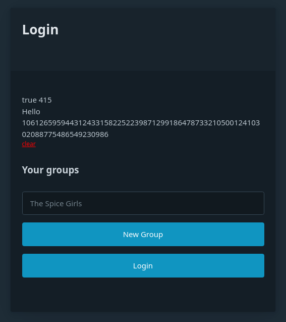
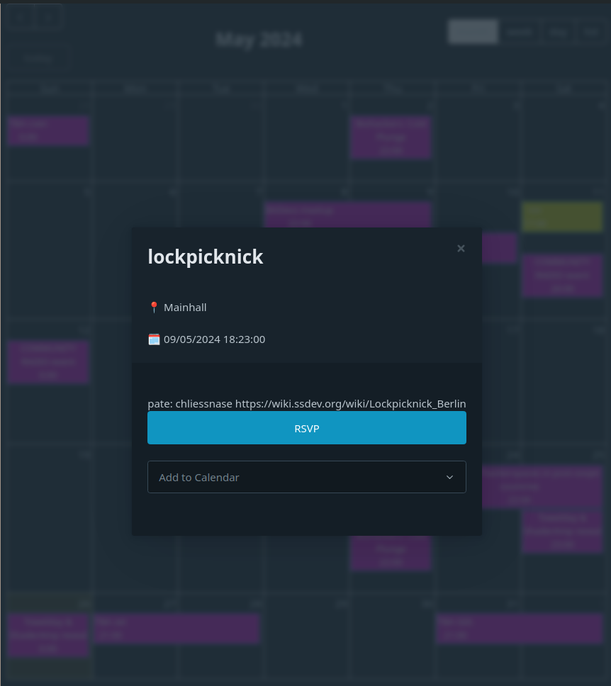

**⚠️ STATUS: NOT READY FOR PRODUCTION USE ⚠️**

This is my submission to ethBerlin04.  it's currently a proof-of-concept / demo.  The main structure is scaffolded into place, but I still need to connect the parts together to make it practically functional. I plan to do this in the next few weeks.  I'll share here when it's ready: https://tally.so/r/wvr558

# ZKal - Decentralised Calendar Solution

ZKal addresses the issue of our reliance on centralised systems, particularly Google Calendar, even among those who advocate for decentralisation. Breaking free from Google Calendar is challenging due to its ingrained network effects and the varying technical abilities within groups.

## Key Problems Addressed

1. **Meeting Confusion**: Users often face problems like confusion over meeting links, with some using Jitsi while others use Google Meet links that were automatically added.
   
2. **Scalability Issues**: Google Calendar struggles with large groups, especially with over 400 or 500 invites.
   
3. **Data Sharing**: Sharing data with Google allows them to create detailed shadow profiles, including information about who you spend time with.
   
4. **Political Centralisation**: SaaS tools' political centralisation creates opacity between teammates, defaulting teams to opacity and causing missed meetings and coordination issues.

## ZKal Solution
ZKal is designed to support a decentralised approach, making it easier for tech community organisers to degoogle and regain control over their calendar data.

ZKal provides a self-hosted calendar feed with a web-based widget that integrates multiple .ICS feeds, allowing for a gradual transition away from Google Calendar.

## Screenshots

### Access with Semaphore

### Calendar View

### RSVP or Anon Add To Cal

### Features

- **Semaphore Integration**: Users access ZKal through Semaphore, maintaining anonymity while proving group membership.
- 
- **Distributed Calendar Administration**: Supports multiple ICS feeds, allowing different rooms or groups to operate on various systems without an all-or-nothing switch from Google Calendar.

- **Proxied Calendar Access**: Users access all event data through a self-hosted proxy, preventing back-ends from seeing subscribers, attendees, IPs, etc. 
  
- **RSVP and Event Creation**: Users can RSVP publicly or anonymously within the Semaphore group.
  
### Trust Model

zKal's starting point is to allow for:
- Users interact with a self-hosted zKal server, hosted by their own community. RSVP and subscriber information is stored there, and under their stewarship.
- User access is granted by proving group membership using [a semaphor](https://semaphore.pse.dev/).
- No event information is sent to back-end calendar providers.  
- Users can optionally RSVP, disclosing their email address to the zKal server and others witn
- Users can interact anonymously, even with their zKal server, because 
### Development Highlights

- **Technology Stack**:
  - Ethereum Foundation's Semaphore libraries
  - Svelte for its simplicity and small components.
  - Node adapter for easy deployment on Docker containers, rooted wifi fridges or any device that's better than a Google datacenter.

  
- **Development Challenges**: Adapting to new development patterns, resolving issues with ESM versus CJS using Vite with Svelte, and deep dives into libraries like Zupass and Semaphore.

## Getting Started

1. Clone the repository from [GitHub](https://github.com/voboda/zKal).
2. Configure your environment using the provided `.env.example` file.
3. Deploy using Docker containers with the included node adapter.

